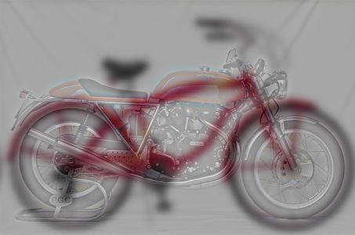

# Hybrid-Image

Build hybrid-image from low-image and high-image images. (low frequencies come from low image nad high frequencies come
from high image.)

Sample:

Low Image | High Image | Hybrid Image
:-----:|:----:|:-----
 |  | 

Resources are added to input directory.